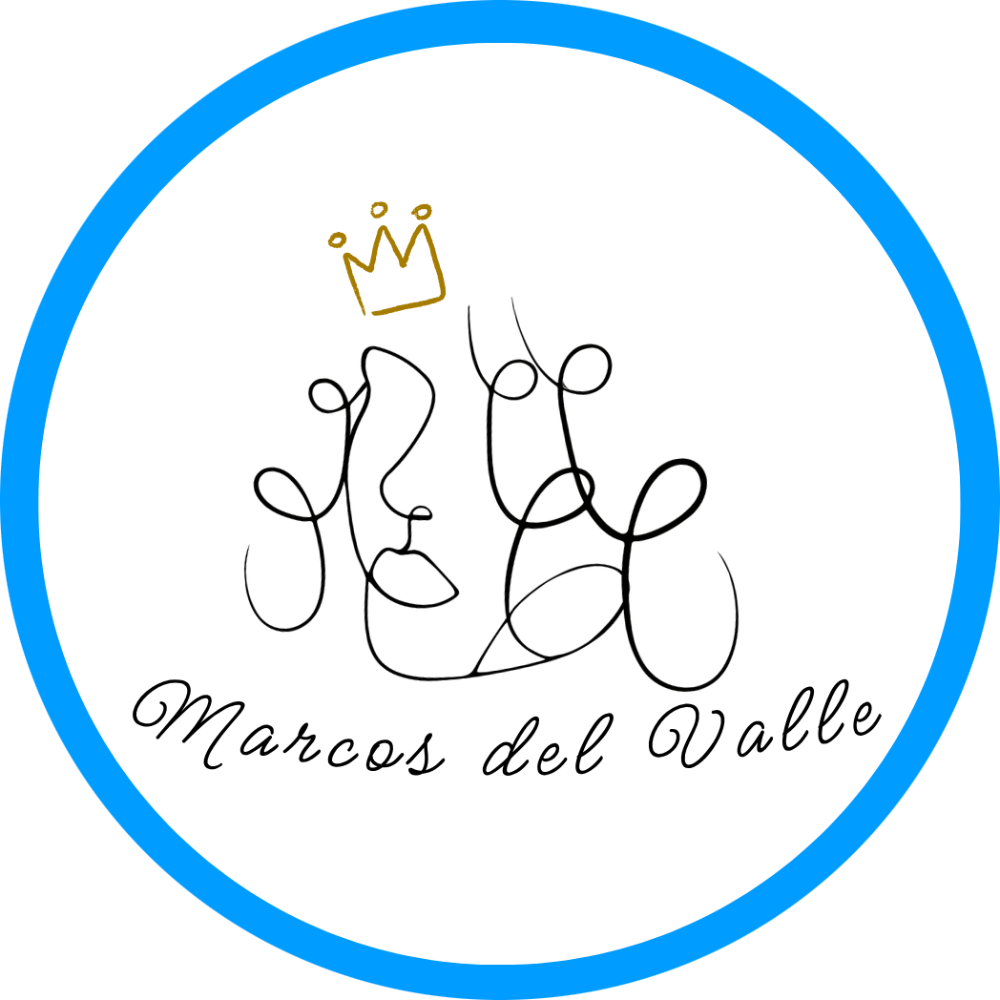

<picture>
  <source media="(prefers-color-scheme: dark)" srcset="assets/banner-dark.svg" />
  <source media="(prefers-color-scheme: light)" srcset="assets/banner-light.svg" />
  
</picture>

<h2 align="left">Hi 👋! I'm Marcos, a Frontend & Interactive Web Developer from Venezuela (based in Spain).</h2>

I build playful, performant UIs with <b>React</b> & <b>Three.js</b>. Currently crafting my
<a href="https://portfolio-rho-nine-97.vercel.app/">interactive portfolio</a> and exploring cybersecurity & shader tricks.

<!-- Avatar -->

<!-- Stats -->

  <picture>
    <!-- Dark: light neon sky blue -->
    <source media="(prefers-color-scheme: dark)" srcset="https://github-readme-stats.vercel.app/api?username=MarcosJVPR&show_icons=true&include_all_commits=true&count_private=true&hide_border=false&title_color=7DF9FF&text_color=E6F7FF&icon_color=7DF9FF&ring_color=7DF9FF&bg_color=0b0f17&cache_seconds=21600" />
    <!-- Light: electric blue -->
    
  </picture>

  <picture>
    <source media="(prefers-color-scheme: dark)" srcset="https://github-readme-stats.vercel.app/api/top-langs?username=MarcosJVPR&layout=compact&card_width=360&langs_count=6&hide_border=false&title_color=7DF9FF&text_color=E6F7FF&bg_color=0b0f17&cache_seconds=21600" />
    
  </picture>

---

<h3>Redes:</h3>

  
  
  

<h3>Habilidades Técnicas</h3>

  
  
  
  
  
  
  
  
  
  
  
  
  
  
  
  
  
  
  
  
  

---

<!-- Snake -->

