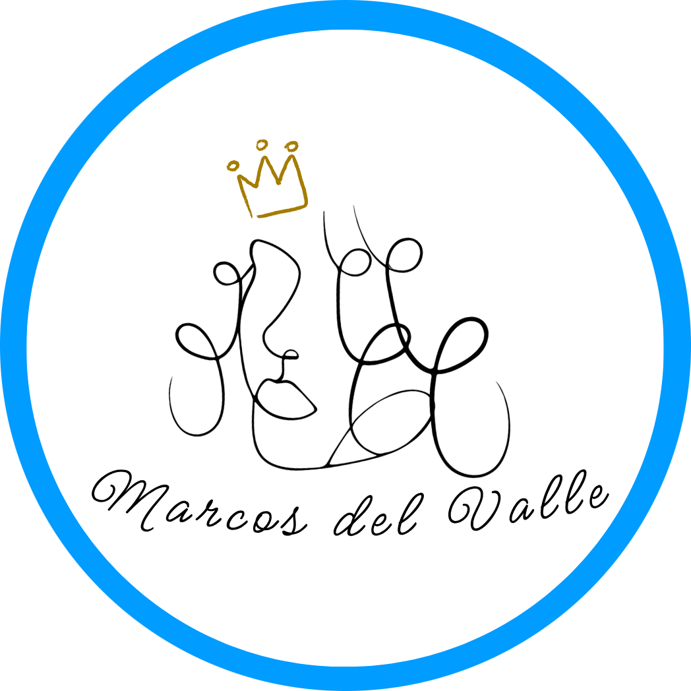

<picture>
  <source media="(prefers-color-scheme: dark)" srcset="assets/banner-dark.svg" />
  <source media="(prefers-color-scheme: light)" srcset="assets/banner-light.svg" />
  
</picture>

<h2 align="left">Hi 👋! I'm Marcos, a Frontend & Interactive Web Developer from Venezuela (based in Spain).</h2>

I build playful, performant UIs with <b>React</b> & <b>Three.js</b>. Currently developing production apps in React/Vite, crafting my <a href="https://portfolio-rho-nine-97.vercel.app/">interactive 3D portfolio</a> (penguin island adventure built with Three.js), and exploring cybersecurity.

<!-- Avatar -->

## Featured Projects

**🗺️ Travel to Spain** — React + Vite + Tailwind  
Real Spanish Tourism API (Dataestur) integration with interactive data visualization and per-destination color themes.  
→ [Live Demo](https://travel-to-spain.vercel.app/) | [Repository](https://github.com/MarcosJVPR/TravelToSpain)

## Connect

- ⚡ **Interactive 3D Portfolio** → https://portfolio-rho-nine-97.vercel.app/
- 💼 **LinkedIn** → https://www.linkedin.com/in/marcosjvpr/
- 📧 **Email** → perezmarcosjulio@gmail.com

## Tech Stack

  
  
  
  
  
  
  
  
  
  
  
  
  

